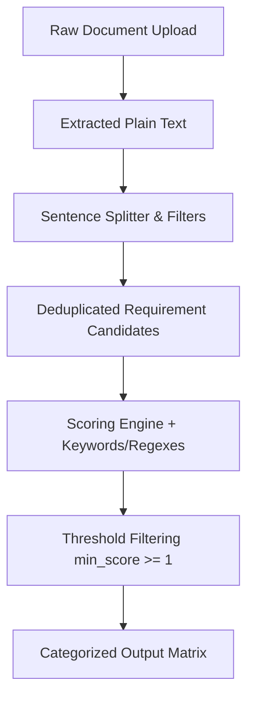

# Requirements Generator

An offline, rule-based requirements classifier and generator designed to parse customer requirement documents, product/platform reference manuals, and regulatory standards. It categorizes statements into four key domains: **Functionality, Mechanism, Performance, and Fault Management** using a deterministic, rule-based approach.

The application is highly optimized for technical specifications, particularly in the EV, Battery, and Battery Management Systems (BMS) domains (including keywords/regexes for AIS-156, State of Charge, cells, thermal runaway, etc.).

---

## 🎯 Key Architectural Constraints

*   **Fully Offline Design**: This application runs entirely offline. There are no AI model endpoints, LLM API calls, or cloud classification dependencies, ensuring maximum data security, zero API costs, and consistent performance.
*   **Isolated External Communications**: Only the URL-fetch parser utility uses network requests (to scrape reference documents/standards). No other backend components make outbound network calls.

---

## 📂 Project Directory Structure

```filepath
requirements-generator/
├── backend/                        # FastAPI Python Backend
│   ├── classifier/                 # Core classification engines
│   │   ├── __init__.py
│   │   ├── engine.py               # Scoring engine and user-rules merger
│   │   └── splitter.py             # Sentence splitter and filters
│   ├── export/                     # Export utilities
│   │   ├── __init__.py
│   │   ├── excel_export.py         # Multi-sheet Excel workbook generator
│   │   └── summary.py              # Statistical calculations for reports
│   ├── parsers/                    # Input document extraction parsers
│   │   ├── __init__.py             # Entry point / routing logic
│   │   ├── docx_parser.py          # Microsoft Word document (.docx) extractor
│   │   ├── pdf_parser.py           # pdfplumber wrapper for text and tables
│   │   ├── txt_parser.py           # UTF-8 and Latin-1 text file reader
│   │   └── url_parser.py           # Webpage scraper (requests + BeautifulSoup)
│   ├── rules/                      # System rules taxonomy definitions
│   │   ├── __init__.py             # Validator and rules loader
│   │   └── categories.json         # Base keywords & regex patterns JSON
│   ├── temp/                       # Directory for temporary files/uploads
│   ├── tests/                      # Automated unit and integration tests
│   │   ├── fixtures/               # Input data files for testing
│   │   ├── output/                 # Generated test reports
│   │   ├── manual_test_flow.py     # End-to-end flow integration test script
│   │   └── test_*.py               # Component unit tests (splitter, parser, etc.)
│   ├── main.py                     # FastAPI entry point, CORS, and API routes
│   ├── requirements.txt            # Python dependencies list
│   └── utils.py                    # File handling helper functions
│
└── frontend/                       # Next.js React Frontend
    ├── app/
    │   ├── globals.css             # Tailwind CSS global styles
    │   ├── layout.tsx              # Root HTML wrapper
    │   └── page.tsx                # Main single-page application UI
    ├── lib/
    │   ├── api.ts                  # Axios API client wrapper
    │   └── constants.ts            # UI dropdown maps and label mappings
    ├── package.json                # Frontend package dependencies & scripts
    ├── postcss.config.mjs          # PostCSS / Tailwind configurations
    └── tsconfig.json               # TypeScript config
```

---

## 🛠️ System Prerequisites

To run the application locally, ensure you have:
*   **Node.js**: `v20+` (Tested on `v24.11.0`)
*   **Python**: `v3.10+` (Tested on `v3.13.9`)

---

## 🚀 Setup & Launch Instructions

### 1. Backend Server Setup & Start

1.  Navigate to the `backend/` directory:
    ```bash
    cd backend
    ```

2.  **Create a Virtual Environment**:
    ```bash
    python -m venv venv
    ```

3.  **Activate the Virtual Environment**:
    *   **Windows (PowerShell)**:
        ```powershell
        .\venv\Scripts\Activate.ps1
        ```
    *   **Windows (CMD)**:
        ```cmd
        .\venv\Scripts\activate.bat
        ```
    *   **macOS / Linux**:
        ```bash
        source venv/bin/activate
        ```

4.  **Install Python Dependencies**:
    ```bash
    pip install -r requirements.txt
    ```

5.  **Start the FastAPI Development Server**:
    ```bash
    uvicorn main:app --reload --port 8000
    ```

6.  **Verify Backend Health**:
    Visit [http://localhost:8000/health](http://localhost:8000/health) in your browser. It should respond with:
    ```json
    {"status": "ok"}
    ```

---

### 2. Frontend Client Setup & Start

1.  Open a new terminal shell and navigate to the `frontend/` directory:
    ```bash
    cd frontend
    ```

2.  **Install Node Dependencies**:
    ```bash
    npm install
    ```

3.  **(Optional) Configure Backend API URL**:
    Create a `.env.local` file in the `frontend/` root to customize the backend endpoint:
    ```env
    NEXT_PUBLIC_API_URL=http://localhost:8000
    ```

4.  **Start the Next.js Development Server**:
    ```bash
    npm run dev
    ```

5.  **Access the Application**:
    Open [http://localhost:3000](http://localhost:3000) in your web browser. The frontend will automatically initialize a new analysis session.

---

## 🧪 Running Automated Tests

A comprehensive unit testing suite is provided in the `backend/tests` folder. Ensure your virtual environment is activated before running tests.

### Run All Unit Tests
Run the standard Python `unittest` suite from the `backend/` directory:
```bash
python -m unittest discover -s tests -p "test_*.py"
```

### Run E2E Integration Flow
To test the complete API workflow sequentially (Session Start -> Upload -> Classify -> Excel Export), run:
1.  Ensure the FastAPI backend is running on port `8000` (or update `URL` at the top of `backend/tests/manual_test_flow.py`).
2.  Run the flow script:
    ```bash
    python tests/manual_test_flow.py
    ```
    Upon completion, it will verify and save a compiled spreadsheet under `backend/tests/output/manual_test_export.xlsx`.

---

## 📖 Classification Methodology & Engine

The system analyzes uploaded texts using a structured pipeline:



### 1. Statement Splitter & Filters (`backend/classifier/splitter.py`)
*   **Sentence Parsing**: Splits text on sentence boundaries (`.`, `;`, `?`).
*   **Abbreviation Lookbehinds**: The splitter employs pre-compiled lookbehinds to prevent breaking on abbreviations (e.g., `e.g.`, `i.e.`, `approx.`, `vs.`, `std.`, `temp.`, `min.`, `max.`, `ref.`, `al.`).
*   **Filters**: Skips statements that are:
    *   Shorter than **15 characters**.
    *   Purely numeric (digits and spaces).
    *   Purely punctuation or symbols (using Unicode category analysis).
*   **Local Deduplication**: Suppresses duplicate candidates within the same document source, preserving the first occurrence.

### 2. Scoring & Classification (`backend/classifier/engine.py`)
Each sentence candidate is evaluated against rules defined in `rules/categories.json`:
*   **Keywords**: Performs case-insensitive substring scans. Each match increments the category score by the category's `weight` (default = `1`).
*   **Regexes**: Executes regex match searches against the original text. Each match increments the category score by the category's `weight`.
*   **Thresholding**: Omit any category classification from the statement if its total score is less than `1`.

### 3. Custom Rule Merging
Users can append custom rules in the frontend input text area. Each instruction line should follow the format:
```text
Category Name: term1, term2, regex:\bmy_regex_pattern\b
```
*Example:*
```text
Functionality: wifi, Bluetooth, shall support OTA
Fault Management: regex:\bshort\s*circuit\b
```
*   Standard terms are converted to lowercase keywords.
*   `regex:` prefixes are parsed, validated, and appended as standard regular expression objects.

---

## 📊 Classification Taxonomy Overview

The classifier assigns statements to four default categories:

| Category | Description | Sample Keywords / Regex Patterns |
| :--- | :--- | :--- |
| **Functionality** | Core capabilities, operational user flows, and features. | `shall support`, `shall enable`, `operational mode`, `user interface`, `regenerative braking control` |
| **Mechanism** | Technical, hardware configurations, materials, and protocols. | `shall use`, `contactor`, `bms`, `can bus`, `printed circuit board`, `ip67`, `thermal management system` |
| **Performance** | Quantitative targets, bounds, limits, tolerances, and capacity metrics. | `shall not exceed`, `sample rate`, `efficiency`, `nominal capacity`, Regexes for physical units: `ms`, `volt`, `ampere`, `kwh`, `°c`, `%`, `hz` |
| **Fault Management**| Safety features, error detection, risk mitigation, and compliance. | `fail-safe`, `thermal runaway`, `overcurrent`, `short circuit`, `diagnostic trouble code`, Regexes for standards: `ais-156`, `ul`, `iso`, `iec` |

---

## 📈 Excel Report Layout & Output

The exported workbook (`requirements_analysis.xlsx`) is dynamically formatted using `openpyxl` with the following structure:

1.  **Summary Sheet**:
    *   A clean title block with project and source context information.
    *   A tabular summary detailing total extracted statements and the absolute count/percentage share of classifications per category.
    *   Formula-driven calculations.
2.  **Category Sheets (Functionality, Mechanism, Performance, Fault Management)**:
    *   Contains columns: `Statement Text`, `Line`, `Source Document`, `Classification Score`, and `Matched Keywords / Patterns`.
    *   Rows are automatically sorted in **descending order** of their classification score.
    *   Table columns auto-adjust to content width.
    *   Headers are styled with professional navy backgrounds (`#1F4E78`) and white text.
